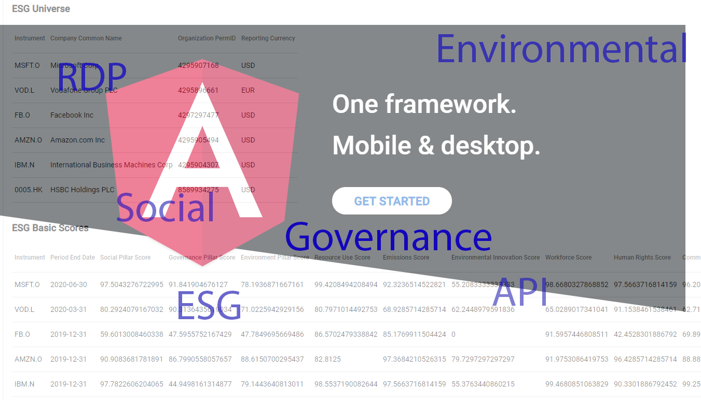
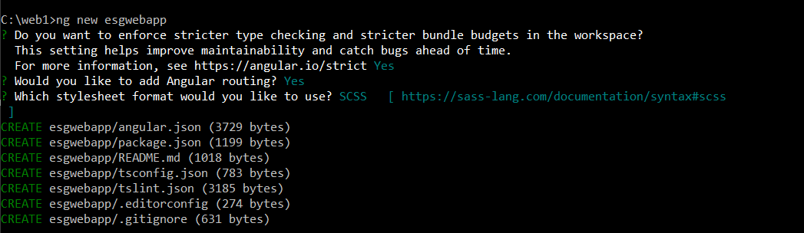
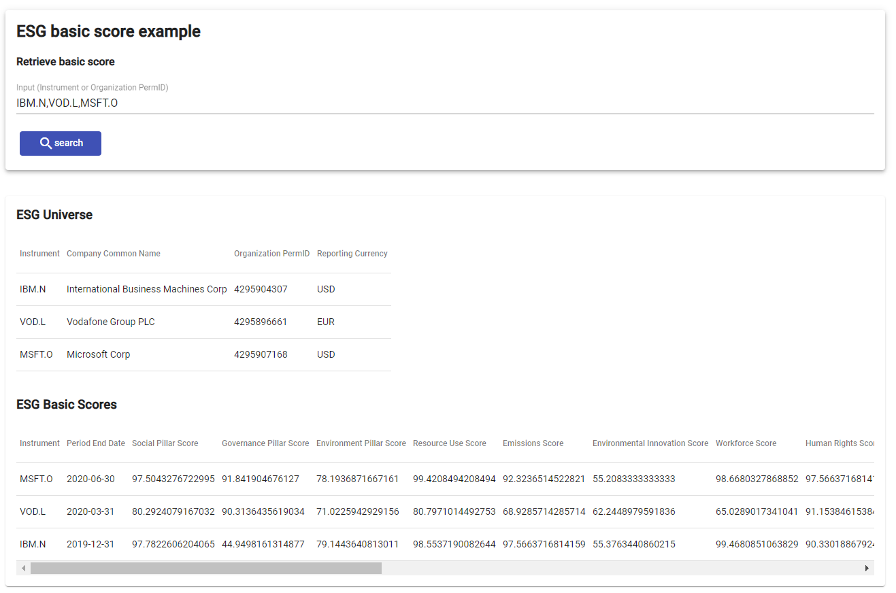
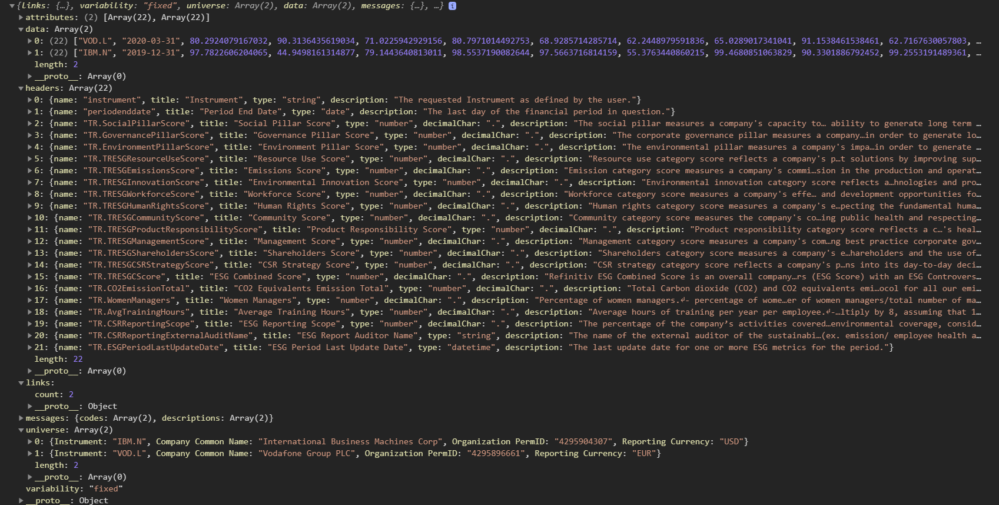

# Building web app to display ESG data using Angular and RDP API

## Overview

This article will show you how to use Refinitiv Data Platform(RDP) REST API with Angular framework to create a sample web application to retrieve  Environmental, Social, and Governance (ESG) basic score data.

Environmental, Social and Governance (ESG) Data Services Covering Thousands of Companies. The Most Comprehensive Resource for Investment Decisions. Learn More & Request Details. Completely Transparent. Company Disclosed Data. 400+ ESG Metrics.

The web application will demonstrate the basic workflows of using RDP REST API and explain the required steps and data structure returned by the RDP services and the message the application needs to parse and retrieve the ESG basic score.



## Prerequisites

* Required basic knowledge of Typescript programming and Angular CLI. We will provide steps to run and test the sample application in a demo section. You can also learn basic knowledge and command line for running angular CLI from [Angular.io](https://angular.io/docs).
  
* Required [Node.js](https://nodejs.org/en/download/), you can also use [nvm](https://github.com/nvm-sh/nvm/releases/tag/v0.37.2) to install LTS version of the Node.js.

* Required Angular CLI. You can find the instruction from [Angular.io](https://angular.io/guide/setup-local) to set up the Cli.

* RDP Account with permission to request data from ESG Services.

## RDP REST API for ESG service

There are two services from the RDP that we will use in the Angular web application.

1) RDP OAuth2 Token interface from EDS Authentication service.
2) ESG Basic interface to get a basic score only for the current year. This one is a basic interface or endpoint which the ESG user should be able to access.

### RDP Token endpoint and required parameters

Basically, the HTTP client library has to send an HTTP Post message to the following endpoint to get the access token.

```url
https://api.refinitiv.com/auth/oauth2/v1/token
```

It requires the following headers to be sent with the HTTP Post request.

```json
{
  "Content-Type":"application/x-www-form-urlencoded",
  "Accept": "application/json"
}
```

The application has to send the following parameters in the HTTP Request body.

* The first set of parameters used to get a new Access Token.
  It required RDP Username, RDP Password, and Application Key from the user.

  ```json
  {
     "username":"RDP Username",
     "password":"loginData.password",
     "grant_type":"password",
     "scope": "trapi",
     "takeExclusiveSignOnControl":true,
     "client_id":"AppKey"
  }
  ```

* The second set of parameters used to get a new Access Token using a Refresh Token instead.

```json
  {
     "username":"RDP Username",
     "grant_type":"refresh_token",
     "refresh_token": "refresh_token",
     "client_id":"AppKey"
  }
  ```

You can find more details about the HTTP Request and the HTTP Response with the JSON response message from this [article](https://developers.refinitiv.com/en/article-catalog/article/oauth-grant-types-in-refinitiv-data-platform)). 
We will use these parameters in our Angular app.

### ESG endpoint and required parameters

Getting the ESG data is quite easy and not complex. 
The application has to send the HTTP Get message with Authorization header to the following endpoint to retrieve ESG basic score.

* HTTP Get Headers

```json
{
  "Authorization": "Bearer <Access Token>",
  "Accept": "application/json"
}
```

* Endpoint

```url
https://api.refinitiv.com/data/environmental-social-governance/v2/views/basic
```
It requires just one query parameter named "universe" like the following sample.

```url
https://api.refinitiv.com/data/environmental-social-governance/v2/views/basic?universe=IBM.N
```

The universe can be Instrument or Organization PermID, and it also supports multiple instruments or PermID like the following sample.

```url
https://api.refinitiv.com/data/environmental-social-governance/v2/views/basic?universe=IBM.N,MSFT.O,AMZN.O,VOD.L
```

The below JSON message is a sample of JSON response messages containing ESG basic score for an instrument named "IBM.N". We need to implement typescript codes to parse the data from the "universe" and "data" sections. And we need to get data headers from the fields under the "headers" section.

```json
{
  "links": {
    "count": 1
  },
  "variability": "fixed",
  "universe": [
    {
      "Instrument": "IBM.N",
      "Company Common Name": "International Business Machines Corp",
      "Organization PermID": "4295904307",
      "Reporting Currency": "USD"
    }
  ],
  "data": [
    [
      "IBM.N",
      "2019-12-31",
      97.7822606204065,
      44.9498161314877,
      79.1443640813011,
      98.5537190082644,
      97.5663716814159,
      55.3763440860215,
      99.4680851063829,
      90.3301886792452,
      99.2553191489361,
      98.8038277511961,
      27.1251673360107,
      74.1800535475234,
      90.2277039848197,
      70.7481052961981,
      1104789,
      28.5,
      77,
      100,
      "2021-03-05T00:00:00"
    ]
  ],
  "messages": {
    "codes": [
      [
        -1,
       ...
        -1,
        -1,
        -1,
        -1,
        -1
      ]
    ],
    "descriptions": [
      {
        "code": -1,
        "description": "ok"
      }
    ]
  },
  "headers": [
    {
      "name": "instrument",
      "title": "Instrument",
      "type": "string",
      "description": "The requested Instrument as defined by the user."
    },
    {
      "name": "periodenddate",
      "title": "Period End Date",
      "type": "date",
      "description": "The last day of the financial period in question."
    },
    ...
    {
      "name": "TR.ESGPeriodLastUpdateDate",
      "title": "ESG Period Last Update Date",
      "type": "datetime",
      "description": "The last update date for one or more ESG metrics for the period."
    }
  ],
  ...
}
```

## Building Angular application

### Setup Angular web application project

First of all, we will use the Angular CLI command __ng new__ to create and initialize the project. You can also download the full project file from [GitHub](https://github.com/Refinitiv-API-Samples/Example.RDPAPI.TypeScript.AngularESGWebapp). Then you can open the project folder in Visual Studio Code or any other IDE.

Please note that we will not explain codes in this article line by line but instead explain only the important parts for API usage.

```command
ng new esgwebapp
```



We will use a built-in dev server that came with the Angular framework to develop and test the application. So you can just run the following command to start the server app and open it on the web browser. By default, it will use port 4200. Then it will start the server and then open <http://localhost:4200>, which is the default project home page on your browser.

```command
..\esgwebapp\ng serve -o
```

I will not explain the basic setting and command line in this article. You can find additional details about the command on Angular.io.

### Setup proxy configuration to avoid CORS issue

There are additional steps you need to set up in the project to call RDP REST API from the Angular app. Typically, if your Angular HTTP client library calls a 3rd party Web API that locates on a different server, you will see an error about  CORS (Cross-Origin Resource Sharing) that does not allow you to call the function. In general, the browser security disallows you from making cross-domain requests except if the HTTP response has a Control-Allow-Origin header with a * value or your client's domain.

We will create a proxy file __proxy.conf.json__ with the following contents to solve the issue.

```json
{
    "/rdpapi": {
      "target": "https://api.refinitiv.com",
      "secure": true,
      "changeOrigin": true,
      "logLevel": "debug",
      "pathRewrite": {
        "^/rdpapi": ""
      }
    }
}

```

This configuration file specifies that any HTTP request that starts with the __/rdpapi/__ path will be sent to the proxy, which will redirect it to the target hostname __api.refinitiv.com__.

We need to add a proxyConfig key to angular.json files so the server can use the proxy setting when we start it with the __ng serve__ command.

You need to open the angular.json file under the angular project folder and then add the following "proxyConfig" configurtion to the config file.

```json
 "serve": {
          "builder": "@angular-devkit/build-angular:dev-server",
          "options": {
            "browserTarget": "esgwebapp:build",
         "proxyConfig": "./proxy.conf.json"
          },
```

In the development phase, we will replace our endpoint from api.refinitiv.com with localhost:4200. And below is a new URL endpoint which we use in the app.

```url
http://localhost:4200/rdpapi/auth/oauth2/v1/token
```

Anyway, in the production, the setting depending on your server setting. You may use reverse proxies like Nginx instead; therefore, the localhost URL and port may differ. I will hard code the proxy URL for demonstration purposes only.

### Create token and authen service to handle RDP access token

Before you can access the ESG service, you need to get the access token from the EDS Authorization service first and then maintain the access token in your app because you need to pass the token in the Authorization headers of the HTTP request when you need to access protected resource or services on the RDP. Our sample app will use localStorage to save the access token and the refresh token. Then we can use the localStorage to get the token and passing it to Authorization Headers when calling HttpClient to send a request in another service or component. In your real app, you may save it to the cloud secure storage or use cookies instead because the 3rd party javascript can attack or access your refresh token using the localStorage as well. We use this approach for demonstration purposes only.

There are three main services in our app, and it was created by using the following command.

```command
ng g s token
ng g s auth
ng g s esg
```

* __TokenService__ was created to add or remove Authorize token data.

The main implementation of the token service is to provide interfaces to get and save the token data.

```ts
//...
export class TokenService {

  constructor() { }

  getToken(): string|null {
    return localStorage.getItem(ACCESS_TOKEN);
  }
  getAppKey(): string|null{
    return localStorage.getItem(APP_KEY);
  }
  getRefreshToken(): string|null {
    return localStorage.getItem(REFRESH_TOKEN);
  }

  //...
  saveRefreshToken(refreshToken: string): void {
    localStorage.setItem(REFRESH_TOKEN, refreshToken);
  }
  saveUsername(username: string): void {
    localStorage.setItem(USER_NAME, username);
  }
  removeToken(): void {
    localStorage.removeItem(ACCESS_TOKEN);
  }
  removeUsername(): void {
    localStorage.removeItem(USER_NAME);
  }
  removeRefreshToken(): void {
    localStorage.removeItem(REFRESH_TOKEN);
  }
}
```

You can find full source codes of the token service from the __token.service.ts__ file located under folder \<project folder>\src\app.

* __AuthService__ was created to handle EDS Authorization.

   The auth service's main implementation provides interfaces to send HTTP request messages to the EDS Authorization service to get new Token data using username and password or to use an Oauth2 refresh token. I will define the proxy URL in the API_URL variable, so you may need to change it when you use a different port.

The application has to inject HttpClient and TokenSevice as a dependency of an application. The app needs to pass it in the constructor to add or remove the token data in the implementation of the service.

   You can find a full source code in __auth.service.ts__.

```ts
const API_URL = 'http://localhost:4200/';
//...

export class AuthService {

  redirectUrl = '';

  private static handleError(error: HttpErrorResponse): any {

    console.error('An error occurred:', error);

    return throwError(
      error);
  }

  private static log(message: string): any {
    console.log(message);
  }

  constructor(private http: HttpClient, private tokenService: TokenService) {
  }
  // Login function to get login using username and password
  login(loginData: any): Observable<any> {

    this.tokenService.removeToken();
    this.tokenService.removeRefreshToken();
    const body = new HttpParams()
      .set('username', loginData.username)
      .set('password', loginData.password)
      .set('grant_type', 'password')
      .set('scope', 'trapi')
      .set('takeExclusiveSignOnControl', 'true')
      .set('client_id', loginData.appkey);


    return this.http.post<any>(API_URL + 'rdpapi/auth/oauth2/v1/token', body.toString(), HTTP_OPTIONS)
      .pipe(
        tap(res => {
          this.tokenService.saveToken(res.access_token);
          this.tokenService.saveRefreshToken(res.refresh_token);
          this.tokenService.saveUsername(loginData.username);
          this.tokenService.saveAppKey(loginData.appkey);
        }),
        catchError(AuthService.handleError)
      );
  }

   // Function to refresh the access token
  refreshToken(refreshData: any): Observable<any> {
    this.tokenService.removeToken();
    this.tokenService.removeRefreshToken();
    const body = new HttpParams()
      .set('refresh_token', refreshData.refresh_token)
      .set('grant_type', 'refresh_token')
      .set('username', this.tokenService.getUsername() as string)
      .set('client_id', this.tokenService.getAppKey() as string);
    return this.http.post<any>(API_URL + 'rdpapi/auth/oauth2/v1/token', body.toString(), HTTP_OPTIONS)
      .pipe(
        tap(res => {
          console.log('Save a new token to local storage');
          this.tokenService.saveToken(res.access_token);
          this.tokenService.saveRefreshToken(res.refresh_token);
        }),
        catchError(AuthService.handleError)
      );
  }
  // Remove the access_token, refresh_token and the username from local storage.
  logout(): void {
    this.tokenService.removeToken();
    this.tokenService.removeRefreshToken();
    this.tokenService.removeUsername();
  }

}
```

* __EsgService__ provides a method to retrieve the ESG basic score data from RDP.

This service's main interface provides the searchEsg method to retrieve ESG basic score from the "/environmental-social-governance/v2/views/basic" RDP endpoint.

```ts
const API_URL = 'http://localhost:4200/';
@Injectable({
  providedIn: 'root'
})
export class EsgService {

  constructor(private http: HttpClient, private tokenService: TokenService) { }
  //...

  searchEsg(universe: string): Observable<any>{
    return this.http.get(API_URL + 'rdpapi/data/environmental-social-governance/v2/views/basic?universe=' + universe)
      .pipe(catchError(EsgService.handleError));
  }
}
```

You may curious why the codes in the method searchEsg work while we did not pass the Authorization and Accept headers in the HTTP Get method. Actually, it's because we add an HTTP interceptor in the Angular application. So when the application sends an HTTP request, the interceptor will check the headers and add the Authorization headers with the required headers before sending the server's request.

### Add HTTP Interceptor to handle HTTP Request headers

Below is the implementation of the HTTP Interceptor; you can find full source codes from auth.interceptor.ts. You can also create the interceptor by using the following command.

```command
ng g interceptor auth
```

The sample codes will check if we have an access token in the localStorage or not and then add it to Authorization headers. There is the scenario that the access token is expired while we send an HTTP request. It will check for HTTP Status code 401 and then try to get a new access token using the refresh token. If successful, it will update the token in localStorage. Then it will try to re-request the data again. This time it should work. Anyway, if it task for getting the new access token failed or the interceptor still receives a status code like 403, it will redirect the user to the login page instead. In your application, you can add additional checks to support your requirement. Our sample shows you an idea to handle the scenario that the access token is expired when requesting ESG data only, and we don't want to make the codes more complicate.

The below snippet codes are the main implementation of the AuthInterceptor, and you can find full source codes from the auth.interceptor.ts.

```ts
@Injectable()
export class AuthInterceptor implements HttpInterceptor {
  constructor(
    private router: Router,
    private tokenService: TokenService,
    private authService: AuthService,
    private http: HttpClient) {
  }

  //....
intercept(request: HttpRequest<any>, next: HttpHandler): any {

    const token = this.tokenService.getToken();
    const refreshToken = this.tokenService.getRefreshToken();

    if (token) {
      request = this.addToken(request, token);
    }

    if (!request.headers.has('Content-Type')) {
      request = request.clone({
        setHeaders: {
          Accept : 'application/json'
        }
      });
    }

    request = request.clone({
      headers: request.headers.set('Accept', 'application/json')
    });
    return next.handle(request).pipe(
      map((event: HttpEvent<any>) => {
        if (event instanceof HttpResponse) {
          console.log('Receive event:', event);
        }
        return event;
      }),
      catchError((error: HttpErrorResponse) => {
        if ( error.url && error?.url?.indexOf('/auth/oauth2/v1/token') < 0 && error.status === 401)
        {
          if (error.statusText === 'Unauthorized')
          {
              if (!this.isRefreshing)
              {
                this.isRefreshing = true;
                this.refreshTokenSubject.next(null);
                return this.authService.refreshToken({refresh_token: refreshToken}).pipe(
                  switchMap((token: any) => {
                    this.isRefreshing = false;
                    this.refreshTokenSubject.next(token.access_token);
                    return next.handle(this.addToken(request, token.access_token));
                  }));
              }else
              {
                return this.refreshTokenSubject.pipe(
                  filter(token => token != null),
                  take(1),
                  switchMap(rdpToken => {
                    return next.handle(this.addToken(request, rdpToken.access_token));
                  }));
              }
          } else {
            this.router.navigate(['login']).then(_ => console.log('redirect to login'));
          }
        }
        else if ( error.status === 403 )
        {
          this.router.navigate(['login']).then(_ => console.log('redirect to login'));
        }
        console.log('ThrowError>>>>', error);
        return throwError(error);
      }));
  }
}

```

### Create Angular Router

The Router enables navigation by interpreting a browser URL as an instruction to change the view. I have to enable the router when calling ng new to create a new project; therefore, Angular CLI will generate app-routing.module.ts under folder \src\app\. The following is a route config that we add to the file to set the route to our Angular component.

```ts

const routes: Routes = [
  { path: '', redirectTo: 'esg', pathMatch: 'full' },
  { path: 'esg', canActivate: [ AuthGuard ], component: EsgComponent },
  { path: 'login', component: LoginComponent },
  { path: '404', component: NotFoundComponent },
  { path: '**', redirectTo: '404' }
];
```

There will be three main Angular components that we will create in this sample app.

* __LoginComponent__ is a component to show the login form and get the user's RDP username and password. If the login is a success, it will change the route to ESGComponent.

* __ESGComponent__ is an ESG main page. It will show a text box to get the input of the universe or keyword from the user and then submit a request to ESG service to get ESG basic score and display data in a table.

* __NotFoundComponent__ is a page to map 404 not found status code to this page. It will show when the user tries to access an unknown URL path.

Basically, you can generate an Angular component using __ng g c \<component name>__ like the following samples.

```command
ng g c login
ng g c esg
ng g c esgdata
ng g c not-found
```

We will explain the implementation of LoginComponent and EsgComponent only.

### Login Component implementation

You can find the implementation to generate the Login UI from the login.component.html under folder \src\app\login. Also, you can find the codes to handle login requests in login.component.ts.

We will use Angular Material to generate the form. The form consists of a text box to get username and password with submit button and now a text box to get AppKey because we will add it to the codes in service implementation instead.

```html
<div class="example-container mat-elevation-z8">

  <mat-card class="example-card">
    <form [formGroup]="loginForm" (ngSubmit)="onFormSubmit()">
      <h2>Log In</h2>
      <mat-form-field class="example-full-width">
        <label>
          <input matInput placeholder="Username" formControlName="username"
                 [errorStateMatcher]="matcher" (focus)="clearErrorMsg()">
        </label>
        <mat-error>
          <span *ngIf="!loginForm.get('username')?.valid && loginForm.get('username')?.touched">Please enter Username</span>
        </mat-error>
      </mat-form-field>
      <mat-form-field class="example-full-width">
        <label>
          <input type="password" matInput placeholder="Password" formControlName="password"
                 [errorStateMatcher]="matcher" (focus)="clearErrorMsg()">
        </label>
        <mat-error>
          <span *ngIf="!loginForm.get('password')?.valid && loginForm.get('password')?.touched">Please enter Password</span>
        </mat-error>
      </mat-form-field>
      <div class="button-row">
        <button type="submit" [disabled]="!loginForm.valid" mat-flat-button color="primary"><mat-icon>login</mat-icon>Login</button>
      </div>
    </form>
    <div *ngIf="!isSuccess">{{errorMsg}}</div>

  </mat-card>
</div>

```

The output will be on the following page.


The method onSubmit from the following Typescript codes will check the login result and show the error message or redirect to the ESG component. It has a dependency on the AuthService and Router.

```ts
export class LoginComponent implements OnInit {

  loginForm!: FormGroup;
  username = '';
  password = '';
  isSuccess:boolean=false;
  errorMsg:string="";
  matcher = new MyErrorStateMatcher();

  constructor(private authService: AuthService, private router: Router, private formBuilder: FormBuilder) { }

  ngOnInit(): void {
    this.loginForm = this.formBuilder.group({
      username : [null, Validators.required],
      password : [null, Validators.required]
    });
  }

  onFormSubmit(): void {
    this.authService.login(this.loginForm.value)
      .subscribe(() => {
        this.isSuccess = true;
        this.errorMsg="";
        this.router.navigate(['/esg']).then(_ => console.log('You are secure now!'));
      }, (err: any) => {

        this.isSuccess= false;
        this.errorMsg=err.error.error+","+err.error.error_description;
      });
  }
  //...
```

If the login is successful,  it will route to the ESG Component page like the following screenshot.


Otherwise, it will show the login error description to the Login UI like the following sample screenshot.


### ESG Component implementation

The ESGComponent is the main UI to get the input of the universe parameters from the user. The input can be Instrument name or the Organization PermID like example input "IBM.N, MSFT.O, VOD.L,4295896661". Users can pass multiple Instruments to the text box. The string should be a comma-separated string like the example input.

This is the HTML to generate the ESG component. You can find the source codes in "\src\app\esg\esg.component.html".

```html
 <mat-card class="mat-elevation-z4">
    <mat-card-header>
      <mat-card-title><div>
        {{message}}  <a mat-flat-button color="primary" (click)="logout()"><mat-icon>logout</mat-icon>Logout</a>
      </div>
      </mat-card-title>
    </mat-card-header>
  </mat-card>

  <br><br>

  <mat-card class="mat-elevation-z4">
  <h2>ESG basic score example</h2>
    <form [formGroup]="searchForm" (ngSubmit)="onSearchSubmit()">
      <h4>Retrieve basic score</h4>
      <mat-form-field class="mat-input-element">
        <label>
          <input matInput placeholder="Input (Instrument or Organization PermID)" formControlName="searchKeyword">
        </label>
      </mat-form-field>
        <button type="submit" [disabled]="!searchForm.valid" mat-flat-button color="primary"><mat-icon>search</mat-icon>search</button>
      </form>
      <div>
        <mat-error *ngIf="searchForm.get('searchKeyword')?.errors?.serverError">
          {{ searchForm.get('searchKeyword')?.errors?.serverError }}
        </mat-error>
      </div>
  </mat-card>
  <br>
<div>

<app-esgdata [hasData]="hasData" [esgList]="esgList" [columnHeaders]="columnHeaders"
             [universeList]="universeList" [universeHeaders]="universeHeaders">

</app-esgdata>
</div>

```

You may notice the \<app-esgdata> tag. It's the angular component to show ESG data in the Angular Material Table. It will bind data passing from ESGComponent to Material data source and automatically generate a table based on the list of column names we set in [columnHeaders] and [universeHeaers] tags. EsgData component is a separate component provided under the folder "\src\app\esgdata".

Below is a code to generate the Material table.

```html
<br>
<mat-card *ngIf="hasData">
  <h3>ESG Universe</h3>
  <table mat-table [dataSource]="universeList" class="table-responsive">

    <ng-container *ngFor="let disCol of universeHeaders; let colIndex = index" matColumnDef="{{disCol}}">
      <th mat-header-cell *matHeaderCellDef>{{disCol}}</th>
      <td mat-cell *matCellDef="let element">{{element[disCol]}}</td>
    </ng-container>

    <tr mat-header-row *matHeaderRowDef="universeHeaders"></tr>
    <tr mat-row *matRowDef="let row; columns: universeHeaders;"></tr>
  </table>

<br>
  <h3>ESG Basic Scores</h3>
<table mat-table [dataSource]="esgList" class="table-responsive">

  <ng-container *ngFor="let disCol of columnHeaders; let colIndex = index" matColumnDef="{{disCol}}">
    <th mat-header-cell *matHeaderCellDef>{{disCol}}</th>
    <td mat-cell *matCellDef="let element">{{element[disCol]}}</td>
  </ng-container>

  <tr mat-header-row *matHeaderRowDef="columnHeaders"></tr>
  <tr mat-row *matRowDef="let row; columns: columnHeaders;"></tr>
</table>
</mat-card>
```

The result after submitting the query will look like the following screenshot.



Let see the codes that pass the query to ESG services and bind the data to the Material Table.

```ts
export class EsgComponent implements OnInit {

  message = '';
  searchForm!: FormGroup;
  searchKeyword='';
  hasData:boolean=false;
  columnHeaders:string[]=[];
  esgList:any[]=[];
  universeList:any[]=[];
  universeHeaders:string[]=[];

  constructor(private authService: AuthService, private tokenService: TokenService, private esgService: EsgService,
              private router: Router,private formBuilder: FormBuilder) { }

  ngOnInit(): void {
      this.hasData = false;
      this.searchForm = this.formBuilder.group({
      searchKeyword : [null, Validators.required]
    });

   this.message=`Hello ${this.tokenService.getUsername()}`;
  }
  //...
  onSearchSubmit(): void
  {
      this.clearData();
      this.esgService.searchEsg(this.searchForm.value.searchKeyword).subscribe((searchData: any) =>
      {
        if ( searchData.error )
        {
          // Failed
          const formControl = this.searchForm.get('searchKeyword');
          if (formControl) {
            // activate the error message
            formControl.setErrors({
              serverError: searchData.error.description
            });
          }

          this.hasData=false;
          this.columnHeaders=[];
          this.esgList=[];
        }
        else
        {
          // Success
          if(searchData.links.count>0)
          {
            this.hasData = true;
            let universeIndex = 0;
            searchData.universe.forEach((universeData:any)=>
            {
              this.universeList[universeIndex++] = universeData;
            });

            this.universeHeaders = Object.keys(this.universeList[0]);
            this.columnHeaders = searchData.headers.map((data: any) => data.title);

            let rowIndex = 0;
            searchData.data.forEach((dataRow: any[]) => {
                let columnIndex = 0;
                this.esgList[rowIndex]={};
                searchData.headers.forEach((header:any)=>
                {
                    this.esgList[rowIndex][header.title]=dataRow[columnIndex];
                    columnIndex++;
                })
                rowIndex++;
            });
            this.hasData = true;
          }else{
            const formControl = this.searchForm.get('searchKeyword');
            if (formControl) {
              // activate the error message
              formControl.setErrors({
                serverError : 'No Data'
              });
            }
          }
        }

      }, error => {
        console.log('Found Error', error);
      });
  }
 //...

}

```

The codes under the following block are the codes to handle ESG JSON messages. 


```ts
 if(searchData.links.count>0)
 {
   /// Parse data from ESG JSON response message.
 }
```

It will check the count of the row under the "data" field and expected that it must match with the number of rows which is an array that contains a list of ESG field values based on the following message structure.



Below codes will get the name of data columns from field name  "headers," which is an array of header objects. We will use an array.map method to create the list from the field named "title". Also, we need to generate the column headers to display universe information from the universe keys, which is a list of the key names.

```ts
  this.universeHeaders = Object.keys(this.universeList[0]);
  this.columnHeaders = searchData.headers.map((data: any) => data.title);
```

To generate a Material Table from the data source automatically, we need to parse the data from a field named "data" to a JSON object like the following format.

```ts
[
{Instrument: "VOD.L", Period End Date: "2020-03-31", Social Pillar Score: 80.2924079167032, Governance Pillar Score: 90.3136435619034, Environment Pillar Score: 71.0225942929156, …}
{Instrument: "IBM.N", Period End Date: "2019-12-31", Social Pillar Score: 97.7822606204065, Governance Pillar Score: 44.9498161314877, Environment Pillar Score: 79.1443640813011, …}
]
```

The following codes will do the job to parse and build the object one by one.


```ts
let rowIndex = 0;
searchData.data.forEach((dataRow: any[]) => 
{
    let columnIndex = 0;
    this.esgList[rowIndex]={};
    searchData.headers.forEach((header:any)=>
    {
        this.esgList[rowIndex][header.title]=dataRow[columnIndex];
        columnIndex++;
    })
    rowIndex++;
});
```

And finally, we need to pass the data to ESGDataComponent to generate the Table. The following codes are the HTML to generate Material Table and bind the data source to each Table to display Universe details and shows a list of ESG basic scores for each Instrument code or PermID. We need to pass the value of esgList to [dataSource] tag.

```html
<br>
<mat-card *ngIf="hasData">
  <h3>ESG Universe</h3>
  <table mat-table [dataSource]="universeList" class="table-responsive">

    <ng-container *ngFor="let disCol of universeHeaders; let colIndex = index" matColumnDef="{{disCol}}">
      <th mat-header-cell *matHeaderCellDef>{{disCol}}</th>
      <td mat-cell *matCellDef="let element">{{element[disCol]}}</td>
    </ng-container>

    <tr mat-header-row *matHeaderRowDef="universeHeaders"></tr>
    <tr mat-row *matRowDef="let row; columns: universeHeaders;"></tr>
  </table>

<br>
  <h3>ESG Basic Scores</h3>
<table mat-table [dataSource]="esgList" class="table-responsive">

  <ng-container *ngFor="let disCol of columnHeaders; let colIndex = index" matColumnDef="{{disCol}}">
    <th mat-header-cell *matHeaderCellDef>{{disCol}}</th>
    <td mat-cell *matCellDef="let element">{{element[disCol]}}</td>
  </ng-container>

  <tr mat-header-row *matHeaderRowDef="columnHeaders"></tr>
  <tr mat-row *matRowDef="let row; columns: columnHeaders;"></tr>
</table>
</mat-card>

```

## Run and Test the application

You can clone or download the project files from [GitHub](https://github.com/Refinitiv-API-Samples/Example.RDPAPI.TypeScript.AngularESGWebapp).

Suppose you run the webpack dev server on another port. You have to update __API_URL__ in auth.service.ts and esg.service.ts to match your setting.

Then go to directory contains the project and run

```command
npm install
```

And start the Angular Cli server using

```command
ng serve -o
```

It will show the login page or show the ESG page if you still do not log out. Below is a demo of application usage. Try it yourself, and feel free to modify the codes if needs.


## Summary

This article shows you a sample web application to retrieve ESG basic score data from the ESG service on the RDP. The example uses the Angular framework with the RDP REST API to get the ESG basic score, bind the data to the Angular material table data source, and show the result on the table. The application also provides sample codes to request the access token and handle refresh token from the EDS Authorization token service. We also provide the instruction to set the Angular dev server to use the proxy to avoid CORS error when calling 3rd party REST API from the local test server. Though the sample codes do not cover all of the scenario or the cases to handle the HTTP response status, we hope it will be a starter sample app for a new RDP user who needs to integrate the data from RDP services Angular web application.

## References

* [Getting Start with Refinitiv Data Platform](https://developers.refinitiv.com/en/article-catalog/article/getting-start-with-refinitiv-data-platform)
* [RDP Documents](https://developers.refinitiv.com/en/api-catalog/refinitiv-data-platform/refinitiv-data-platform-apis/documentation)
* [ESG User Guide](https://developers.refinitiv.com/en/api-catalog/refinitiv-data-platform/refinitiv-data-platform-apis/documentation#esg-user-guide)
* [ESG Data Guide](https://developers.refinitiv.com/en/api-catalog/refinitiv-data-platform/refinitiv-data-platform-apis/documentation#esg-data-guide)
* [Quickstart guide for ESG](https://developers.refinitiv.com/en/api-catalog/refinitiv-data-platform/refinitiv-data-platform-apis/quick-start#quickstart-guide-for-esg)
* [Introduction to the Angular Docs](https://angular.io/docs)
